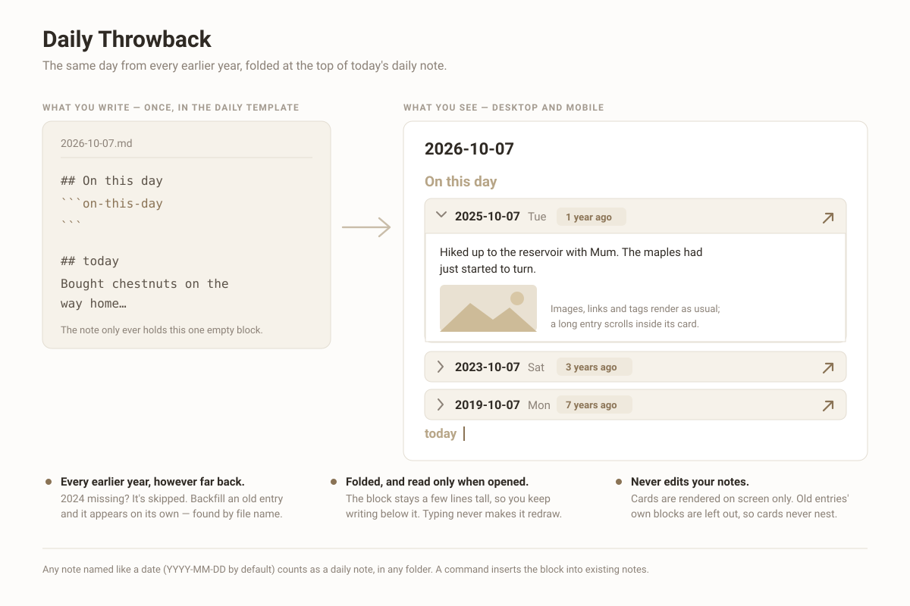

# Daily Throwback

Show the same day from every earlier year at the top of your daily note — one folding card per year, with the full entry inside. Works on desktop and mobile, and never edits your notes.



## Usage

Put this code block where you want the cards, usually at the top of your daily note template:

````markdown
## On this day
```on-this-day
```

## today
````

Open any daily note and the block lists the entries for the same month and day from **every earlier year**, newest first: 1 year ago, 3 years ago, 7 years ago… Years with no entry are skipped. Notes you backfill later show up on their own, because the list is looked up each time the note opens; the note itself only ever holds that one empty block.

For notes written before you added it to the template, run the command **Insert the On this day block into this note**. It puts the block after the front matter (or under an existing *On this day* heading) and adds a `## today` heading if the note has none. Running it twice does nothing.

The block also answers to the name `往年今日`.

## Cards

- Cards start folded, so the block stays a few lines tall and you keep writing below it. An old entry is only read and rendered when you open its card.
- Inside a card the entry renders as usual: images, links, tags, tables. Long entries scroll inside the card instead of pushing today's writing down.
- The arrow button opens that day's note. Links inside a card resolve relative to the old note.
- Front matter, the old note's own *On this day* block and its `## today` heading are left out, so cards never nest.
- Typing in today's note never makes the block redraw. Editing an old entry elsewhere refreshes its card if it is open.

## Which notes count

Any Markdown file whose name parses as a date in the configured format (`YYYY-MM-DD` by default), in any folder. Weekly notes like `2026-01-W05` and names that merely start with a date do not count. February 29 lines up with other leap years only.

## Settings

| Setting | Default | |
|---|---|---|
| Date format | `YYYY-MM-DD` | Moment.js format of daily note file names. Folders in the format are ignored. |
| Folder | empty (whole vault) | Only look for daily notes inside this folder and its subfolders. |
| Expand the most recent entry | off | Open the newest card automatically. |

## Notes

- Nothing is written to your notes except by the insert command, which you run yourself. No network access is used.
- In Live Preview, Obsidian's own "edit block" button is hidden on this block so it doesn't cover the cards; use the arrow keys or Source mode to reach the block's source.
- If the plugin is disabled, the block shows up as an empty code block. Delete it or re-enable the plugin.
- The interface follows Obsidian's own language setting: Chinese when the app is in Chinese, English everywhere else.

## Installing

Community plugins → Browse → search for *Daily Throwback*.

Manually: download `main.js`, `manifest.json` and `styles.css` from the [latest release](https://github.com/RainaJIA716/obsidian-daily-throwback/releases/latest) into `<vault>/.obsidian/plugins/daily-throwback/`, then enable it in Settings.

## Development

```bash
npm install
npm run dev     # watch build into main.js
npm test        # smoke test against a stubbed Obsidian API
npm run build   # production build
```

Releases are built by GitHub Actions from a version tag and signed with build provenance.

## License

MIT
